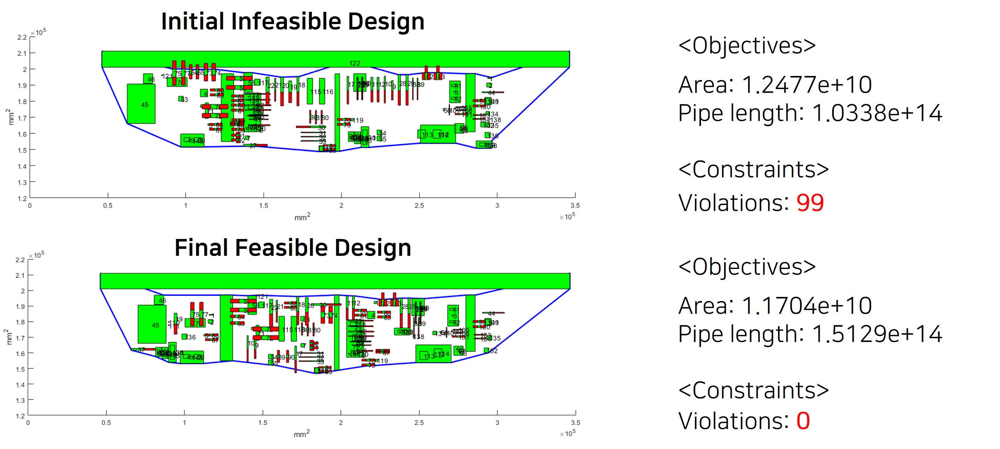

Large-scale Layout Optimization for Chemical Plant
(2021.5 - 2022.10)

In the equipment layout design stage, we solved an optimization problem to minimize the plant area and the length of connecting pipes between equipment by utilizing only the initial equipment positions and constraint information between equipment, without detailed drawings.

- We developed an optimization algorithm for large-scale layout optimization.

- We enabled design exploration that satisfies all constraints even for a large number of items.

- We aimed to minimize both area and pipe length.
<!--more-->
