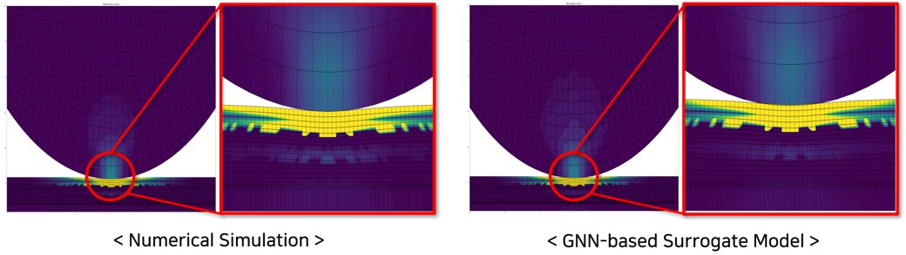

Development of an AI Model for Mobile Display Panel Stress Prediction Using MeshGraphNet
(2022.5 - 2023.2)

- We achieved over 80% accuracy in predicting maximum panel stress compared to commercial simulation programs (e.g., ANSYS, ABAQUS).

- We reduced cost and time while improving speed and efficiency by applying the AI model compared to conventional dynamic analysis methods.

- We aim to optimize thin film thickness, materials, and PO Mobile panel stacking structure through Ball Impact simulations.

<!--more-->
